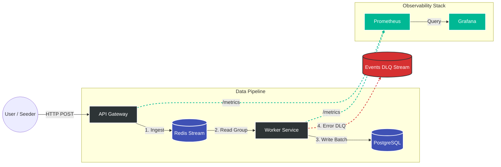

# Event Analytics Platform


**A high-performance, self-hosted event analytics platform.**
Designed to handle real-time ingestion, processing, and visualization of user behavior data. Built to evolve from a simple API to a distributed event-driven system.

> The goal is to build a scalable pipeline comparable to Mixpanel/Amplitude but open-source.

---

## Architecture



- [architecture](./docs/architecture/)

---

## Tech Stack

### **Core**


### **Streaming & Storage:**


### **Infrastructure:**


### **Migrations**


---

## Roadmap & Progress

- [x] **Stage 1: Backend Foundation**
  - [x] Clean Architecture, DI (Dishka), UoW.
  - [x] High-performance Batch Ingestion (asyncpg + executemany).
  - [x] Fail-safe validation strategy (Pydantic v2).
  - [x] Structured Logging & Metrics preparation.
  - [x] Load Testing benchmarks ([View Results](./benchmarks/stage1_sync_ingestion.md)).

- [/] **Stage 2: Async Processing** (Current Focus)
  - [x] Decouple API from DB using Redis Streams.
  - [x] Background Workers implementation.
  - [x] At-least-once delivery guarantees.
  - [ ] Load Testing benchmarks ([View Results]()).

- [ ] **Stage 3: CDC & OLAP**
  - [ ] ClickHouse setup.
  - [ ] Debezium & Kafka (CDC).
  - [ ] Migration data from Postgre to Clickhouse

- [ ] **Stage 4: Orchestration & Quality**

- [ ] **Stage 5: Production Deploy (VPS)**

- [ ] **Stage 6: Kubernetes**

- [ ] **Stage 7: Cloud Migration (AWS/GCP)**

---

## Getting Started

### Prerequisites

- Python 3.13+
- Docker & Docker Compose

### Installation

1. Clone the repository

```bash
git clone https://github.com/jinjik19/event_analytics_platform.git
cd event_analytics_platform/
```

2. Run the API Server

```bash
# Start all services
make start
# OR
docker-compose up -d --build
```

3. Check Health

```bash
curl http://localhost:8000/health
# Output: {"status": "ok"}
```

Prometheus Targets - http://localhost:9090/targets
Grafana - http://localhost:3000

4. Create/Run migration (optional, because migrations apply with docker containers up)

#### Create migration.

1. Create sql file with your command in db/schema/postgres
2. Run command

```bash
atlas migrate diff some_name --env postgres
```

#### Run migration

```bash
atlas migrate apply --env postgres
```

5. OpenAPI/Swagger - http://localhost:8000/docs#/

---

### Additional utils

1. Seed

#### Run seed

```bash
make seed-start
```

#### Stop seed

```bash
make seed-stop
```

2. Load Tests

Information about load test [load_tests](./tests/load/README.md)

---

📝 License

This project is licensed under the MIT License.
