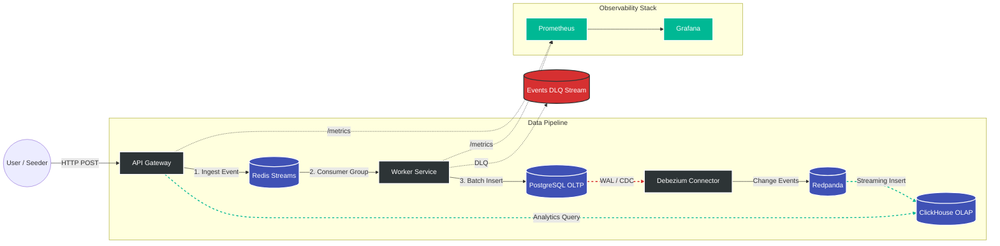

# Event Analytics Platform


**A high-performance, self-hosted event analytics platform.**
Designed to handle real-time ingestion, processing, and visualization of user behavior data. Built to evolve from a simple API to a distributed event-driven system.

> The goal is to build a scalable pipeline comparable to Mixpanel/Amplitude but open-source.

---

## Architecture


```mermaid
flowchart LR
    %% Styles
    classDef storage fill:#3f51b5,stroke:#fff,stroke-width:2px,color:#fff;
    classDef service fill:#2d3436,stroke:#fff,stroke-width:2px,color:#fff;
    classDef monitor fill:#00b894,stroke:#fff,stroke-width:2px,color:#fff;
    classDef dead fill:#d63031,stroke:#333,stroke-width:2px,color:#fff;

    %% Input
    User((User / Seeder)) -->|HTTP POST| API[API Gateway]:::service

    %% Main Data Flow
    subgraph "Data Pipeline"
        API -->|1. Ingest Event| Stream[(Redis Streams)]:::storage
        Stream -->|2. Consumer Group| Worker[Worker Service]:::service
        Worker -->|3. Batch Insert| DB[(PostgreSQL OLTP)]:::storage

        DB -->|WAL / CDC| Debezium[Debezium Connector]:::service
        Debezium -->|Change Events| Broker[(Redpanda)]:::storage
        Broker -->|Streaming Insert| DW[(ClickHouse OLAP)]:::storage

        API -->|Analytics Query| DW
    end

    %% Error Handling
    Worker -.->|DLQ| DLQ[(Events DLQ Stream)]:::dead

    %% Observability
    subgraph "Observability Stack"
        Prometheus[Prometheus]:::monitor
        Grafana[Grafana]:::monitor

        Prometheus --> Grafana
    end

    %% Metrics Scraping
    API -.->|/metrics| Prometheus
    Worker -.->|/metrics| Prometheus

    %% Link Styling
    linkStyle 4 stroke:#d63031,stroke-width:2px,stroke-dasharray: 5 5;
    linkStyle 6,7 stroke:#00b894,stroke-width:2px,stroke-dasharray: 5 5;
```

- [architecture](./docs/architecture/)

---

## Tech Stack

### **Core**


### **Databases:**


### **Data Streaming:**


### **Analytics:**


### **Infrastructure:**


### **Migrations**


---

## Roadmap & Progress

- [x] **Stage 1: Backend Foundation**
  - [x] Clean Architecture, DI (Dishka), UoW.
  - [x] High-performance Batch Ingestion (asyncpg + executemany).
  - [x] Fail-safe validation strategy (Pydantic v2).
  - [x] Structured Logging & Metrics preparation.
  - [x] Load Testing benchmarks ([View Results](./benchmarks/stage1_sync_ingestion.md)).

- [x] **Stage 2: Async Processing** (Current Focus)
  - [x] Decouple API from DB using Redis Streams.
  - [x] Background Workers implementation.
  - [x] At-least-once delivery guarantees.
  - [x] Load Testing benchmarks ([View Results](./benchmarks/stage2_with_redis_stream.md)).

- [x] **Stage 3: CDC & OLAP**
  - [x] ClickHouse setup.
  - [x] Debezium & Redpanda (CDC).
  - [x] Analytical api

- [x] **Stage 4: Orchestration & Quality**
  - [x] dbt staging models with deduplication, normalization, tests and documentation.
  - [x] dbt marts (pre-aggregated tables for Analytics API).
  - [x] Rewrite Analytics API queries to read from marts instead of raw tables.
  - [x] Airflow orchestration via Cosmos (scheduled dbt runs, model-level DAG visibility).

- [ ] **Stage 5: Kubernetes (local)**
  - [ ] k3d cluster setup
  - [ ] Kubernetes manifests (Helm charts)

- [ ] **Stage 6: Cloud Migration (GCP/GKE)**
  - [ ] GKE deployment
  - [ ] ClickHouse Cloud integration

---

## Analytics API

All analytics endpoints require authentication via `X-Api-Key` header.
`project_id` is resolved automatically from the API key — no need to pass it explicitly.

### `GET /api/v1/analytics/events-per-day`

Returns the number of events per day for the project. Results are cached for **15 minutes**.

```bash
curl http://localhost:8000/api/v1/analytics/events-per-day \
  -H "X-Api-Key: <your_api_key>"
```

**Response `200 OK`:**

```json
[
  { "date": "2026-03-10", "count": 20088 },
  { "date": "2026-03-11", "count": 7978 },
  { "date": "2026-03-12", "count": 2310 }
]
```

---

### `GET /api/v1/analytics/funnel`

Returns funnel conversion metrics for a sequence of event types.
Results are cached for **45 minutes** (or **24 hours** for fully historical date ranges).

**Query parameters:**

| Parameter     | Type       | Default                                          | Description                          |
| ------------- | ---------- | ------------------------------------------------ | ------------------------------------ |
| `steps`       | `string[]` | `page_view, product_view, add_to_cart, purchase` | Ordered funnel steps                 |
| `date_from`   | `date`     | today − 30 days                                  | Start date (`YYYY-MM-DD`)            |
| `date_to`     | `date`     | today                                            | End date (`YYYY-MM-DD`)              |
| `window_days` | `int`      | `604800` (7 days in seconds)                     | Max time between first and last step |

```bash
# Default funnel (last 30 days, 4 steps)
curl "http://localhost:8000/api/v1/analytics/funnel" \
  -H "X-Api-Key: <your_api_key>"

# Custom steps and date range
curl "http://localhost:8000/api/v1/analytics/funnel?steps=page_view&steps=add_to_cart&steps=purchase&date_from=2026-03-01&date_to=2026-03-12" \
  -H "X-Api-Key: <your_api_key>"
```

**Response `200 OK`:**

```json
[
  {
    "step": "page_view",
    "users": 9500,
    "conversion_from_prev": null,
    "conversion_from_top": 100.0
  },
  {
    "step": "product_view",
    "users": 4200,
    "conversion_from_prev": 44.2,
    "conversion_from_top": 44.2
  },
  {
    "step": "add_to_cart",
    "users": 1800,
    "conversion_from_prev": 42.9,
    "conversion_from_top": 18.9
  },
  {
    "step": "purchase",
    "users": 540,
    "conversion_from_prev": 30.0,
    "conversion_from_top": 5.7
  }
]
```

> Full interactive docs available at **http://localhost:8000/docs**

---

### `GET /api/v1/analytics/top-products`

Returns top products ranked by cart additions or revenue.
Results are cached for **30 minutes** (or **24 hours** for fully historical date ranges).

**Query parameters:**

| Parameter   | Type     | Default         | Description                            |
| ----------- | -------- | --------------- | -------------------------------------- |
| `metric`    | `string` | —               | Sort metric: `by_cart` or `by_revenue` |
| `date_from` | `date`   | today − 30 days | Start date (`YYYY-MM-DD`)              |
| `date_to`   | `date`   | today           | End date (`YYYY-MM-DD`)                |
| `limit`     | `int`    | `10`            | Number of results (1–100)              |

```bash
curl "http://localhost:8000/api/v1/analytics/top-products?metric=by_revenue&limit=5" \
  -H "X-Api-Key: <your_api_key>"
```

**Response `200 OK`:**

```json
[
  {
    "category": "Electronics",
    "product_id": "prod-001",
    "product_name": "Wireless Headphones",
    "add_to_cart_count": 320,
    "purchase_count": 95,
    "revenue": 9405.5
  }
]
```

---

### `GET /api/v1/analytics/top-countries`

Returns top countries by user activity or revenue.
Results are cached for **10 minutes** (or **24 hours** for fully historical date ranges).

**Query parameters:**

| Parameter   | Type     | Default         | Description                                           |
| ----------- | -------- | --------------- | ----------------------------------------------------- |
| `sort_by`   | `string` | `by_users`      | Sort metric: `by_users`, `by_events`, or `by_revenue` |
| `date_from` | `date`   | today − 30 days | Start date (`YYYY-MM-DD`)                             |
| `date_to`   | `date`   | today           | End date (`YYYY-MM-DD`)                               |
| `limit`     | `int`    | `10`            | Number of results (1–100)                             |

```bash
curl "http://localhost:8000/api/v1/analytics/top-countries?sort_by=by_revenue&limit=10" \
  -H "X-Api-Key: <your_api_key>"
```

**Response `200 OK`:**

```json
[
  {
    "country": "United States",
    "unique_users": 4200,
    "events_count": 38500,
    "revenue": 52300.75
  }
]
```

---

### `GET /api/v1/analytics/retention`

Returns cohort retention matrix. Day 0 = date of user's first event.
Results are cached for **10 minutes** (or **24 hours** for fully historical date ranges).

**Query parameters:**

| Parameter   | Type   | Default         | Description                      |
| ----------- | ------ | --------------- | -------------------------------- |
| `date_from` | `date` | today − 30 days | Cohort start date (`YYYY-MM-DD`) |
| `date_to`   | `date` | today           | Cohort end date (`YYYY-MM-DD`)   |
| `days`      | `int`  | `14`            | Max day number to track (1–365)  |

```bash
curl "http://localhost:8000/api/v1/analytics/retention?date_from=2026-03-01&date_to=2026-03-21&days=7" \
  -H "X-Api-Key: <your_api_key>"
```

**Response `200 OK`:**

```json
[
  {
    "cohort_date": "2026-03-01",
    "day_number": 0,
    "retained_users": 120,
    "cohort_size": 120,
    "retention_pct": 100.0
  },
  {
    "cohort_date": "2026-03-01",
    "day_number": 1,
    "retained_users": 74,
    "cohort_size": 120,
    "retention_pct": 61.7
  },
  {
    "cohort_date": "2026-03-01",
    "day_number": 7,
    "retained_users": 31,
    "cohort_size": 120,
    "retention_pct": 25.8
  }
]
```

> Response is a flat list — client maps it into a matrix by `cohort_date` × `day_number`.

---

## Data Transformations (dbt)

dbt transforms raw ClickHouse data into clean, tested, documented models.
Project lives in `orchestrator/include/event_analytics_dbt/`.

**Model structure:**
```
raw.event  (source, CDC)
    └── analytics.stg_events          (view)  — deduplicated, normalized
            ├── analytics.mart_events_per_day   (table) — daily event counts
            ├── analytics.mart_top_products     (table) — cart & revenue metrics
            ├── analytics.mart_top_countries    (table) — geo metrics (AggregatingMergeTree)
            └── analytics.mart_retention        (table) — Day-N cohort retention
```

### Commands

```bash
make dbt-build      # run models + tests in DAG order (recommended)
make dbt-run        # run models only
make dbt-test       # run tests only
make dbt-freshness  # check CDC source freshness (warn >1h, error >24h)
make dbt-docs       # generate and serve docs → http://localhost:18080
```

### Documentation

```bash
make dbt-docs
```

Opens interactive documentation at **http://localhost:18080** with:
- Full data lineage graph (`raw.event` → `stg_events` → marts)
- Column descriptions and data tests
- Source freshness status

---

## Orchestration (Airflow)

Apache Airflow via [Astronomer CLI](https://www.astronomer.io/docs/astro/cli/overview) orchestrates scheduled dbt runs.
Project lives in `orchestrator/`.

**Pipeline:**
```
Airflow (Cosmos) → dbt run (staging → marts) → dbt test
```

### Commands

```bash
make airflow-start    # start Airflow locally (Astronomer CLI)
make airflow-stop     # stop
make airflow-restart  # restart
make airflow-logs     # tail logs
```

Airflow UI — **http://localhost:8080** (admin / admin)

---

## Observability

All dashboards are provisioned automatically — no manual setup required.

| Service    | URL                                      |
|------------|------------------------------------------|
| Grafana    | http://localhost:3000 (admin / admin)    |
| Prometheus | http://localhost:9090/targets            |

### Dashboards

**CDC Monitoring** — replication health between PostgreSQL and ClickHouse:

- E2E replication lag (`cdc_e2e_lag`) with alert threshold at 10s
- Debezium connector status

**API** — HTTP layer performance:

- Request rate, latency (p95), error rate

**Worker** — async processing pipeline:

- Events processed, DLQ size, consumer lag

---

## Getting Started

### Prerequisites

- Python 3.13+
- Docker & Docker Compose
- [Astronomer CLI](https://www.astronomer.io/docs/astro/cli/install-cli) (`brew install astro`)

### Installation

1. Clone the repository

```bash
git clone https://github.com/jinjik19/event_analytics_platform.git
cd event_analytics_platform/
```

2. Configure environment

```bash
cp .env.example .env
cp orchestrator/.env.example orchestrator/.env
# Fill in credentials in both files
```

3. Start the main stack

```bash
make start
# OR
docker-compose up -d --build
```

4. Check Health

```bash
curl http://localhost:8000/health
# Output: {"status": "ok"}
```

5. Start Airflow

```bash
make airflow-start
# Airflow UI → http://orchestrator.localhost:6563 (admin / admin) — `make airflow-start`
```

6. Run dbt models manually (optional — Airflow runs these on schedule)

```bash
make dbt-build
```

### Services

| Service        | URL                                        |
|----------------|--------------------------------------------|
| API            | http://localhost:8000                      |
| Swagger UI     | http://localhost:8000/docs                 |
| Airflow UI     | http://orchestrator.localhost:6563 (admin / admin)            |
| Grafana        | http://localhost:3000 (admin / admin)      |
| Prometheus     | http://localhost:9090/targets              |
| dbt Docs       | http://localhost:18080 (`make dbt-docs`)   |

### Migrations (optional)

Migrations apply automatically on container startup.

#### Create migration

```bash
# Postgres
atlas migrate diff some_name --env postgres
```

#### Apply migration

```bash
atlas migrate apply --env postgres
```

---

### Additional utils

**Seed** — generate realistic test data

```bash
make seed-start   # start seeder
make seed-stop    # stop seeder
```

**Load Tests** — see [load_tests](./tests/load/README.md)

```bash
make load-realistic-1   # 1000 users, 5 min
make load-stress        # stress test, 500 users
```

---

📝 License

This project is licensed under the MIT License.
