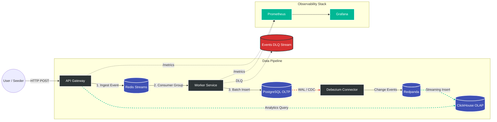

# Event Analytics Platform


**A high-performance, self-hosted event analytics platform.**
Designed to handle real-time ingestion, processing, and visualization of user behavior data. Built to evolve from a simple API to a distributed event-driven system.

> The goal is to build a scalable pipeline comparable to Mixpanel/Amplitude but open-source.

---

## Architecture


```mermaid
flowchart LR
    %% Styles
    classDef storage fill:#3f51b5,stroke:#fff,stroke-width:2px,color:#fff;
    classDef service fill:#2d3436,stroke:#fff,stroke-width:2px,color:#fff;
    classDef monitor fill:#00b894,stroke:#fff,stroke-width:2px,color:#fff;
    classDef dead fill:#d63031,stroke:#333,stroke-width:2px,color:#fff;

    %% Input
    User((User / Seeder)) -->|HTTP POST| API[API Gateway]:::service

    %% Main Data Flow
    subgraph "Data Pipeline"
        API -->|1. Ingest Event| Stream[(Redis Streams)]:::storage
        Stream -->|2. Consumer Group| Worker[Worker Service]:::service
        Worker -->|3. Batch Insert| DB[(PostgreSQL OLTP)]:::storage

        DB -->|WAL / CDC| Debezium[Debezium Connector]:::service
        Debezium -->|Change Events| Broker[(Redpanda)]:::storage
        Broker -->|Streaming Insert| DW[(ClickHouse OLAP)]:::storage

        API -->|Analytics Query| DW
    end

    %% Error Handling
    Worker -.->|DLQ| DLQ[(Events DLQ Stream)]:::dead

    %% Observability
    subgraph "Observability Stack"
        Prometheus[Prometheus]:::monitor
        Grafana[Grafana]:::monitor

        Prometheus --> Grafana
    end

    %% Metrics Scraping
    API -.->|/metrics| Prometheus
    Worker -.->|/metrics| Prometheus

    %% Link Styling
    linkStyle 4 stroke:#d63031,stroke-width:2px,stroke-dasharray: 5 5;
    linkStyle 6,7 stroke:#00b894,stroke-width:2px,stroke-dasharray: 5 5;
```

- [architecture](./docs/architecture/)

---

## Tech Stack

### **Core**


### **Databases:**


### **Data Streaming:**


### **Infrastructure:**


### **Migrations**


---

## Roadmap & Progress

- [x] **Stage 1: Backend Foundation**
  - [x] Clean Architecture, DI (Dishka), UoW.
  - [x] High-performance Batch Ingestion (asyncpg + executemany).
  - [x] Fail-safe validation strategy (Pydantic v2).
  - [x] Structured Logging & Metrics preparation.
  - [x] Load Testing benchmarks ([View Results](./benchmarks/stage1_sync_ingestion.md)).

- [x] **Stage 2: Async Processing** (Current Focus)
  - [x] Decouple API from DB using Redis Streams.
  - [x] Background Workers implementation.
  - [x] At-least-once delivery guarantees.
  - [x] Load Testing benchmarks ([View Results](./benchmarks/stage2_with_redis_stream.md)).

- [/] **Stage 3: CDC & OLAP**
  - [x] ClickHouse setup.
  - [x] Debezium & Redpanda (CDC).
  - [/] Analytical api

- [ ] **Stage 4: Orchestration & Quality**

- [ ] **Stage 5: Production Deploy (VPS)**

- [ ] **Stage 6: Kubernetes**

- [ ] **Stage 7: Cloud Migration (AWS/GCP)**

---

## Analytics API

All analytics endpoints require authentication via `X-Api-Key` header.
`project_id` is resolved automatically from the API key — no need to pass it explicitly.

### `GET /api/v1/analytics/events-per-day`

Returns the number of events per day for the project. Results are cached for **15 minutes**.

```bash
curl http://localhost:8000/api/v1/analytics/events-per-day \
  -H "X-Api-Key: <your_api_key>"
```

**Response `200 OK`:**
```json
[
  { "date": "2026-03-10", "count": 20088 },
  { "date": "2026-03-11", "count": 7978 },
  { "date": "2026-03-12", "count": 2310 }
]
```

---

### `GET /api/v1/analytics/funnel`

Returns funnel conversion metrics for a sequence of event types.
Results are cached for **45 minutes** (or **24 hours** for fully historical date ranges).

**Query parameters:**

| Parameter | Type | Default | Description |
|-----------|------|---------|-------------|
| `steps` | `string[]` | `page_view, product_view, add_to_cart, purchase` | Ordered funnel steps |
| `date_from` | `date` | today − 30 days | Start date (`YYYY-MM-DD`) |
| `date_to` | `date` | today | End date (`YYYY-MM-DD`) |
| `window_days` | `int` | `604800` (7 days in seconds) | Max time between first and last step |

```bash
# Default funnel (last 30 days, 4 steps)
curl "http://localhost:8000/api/v1/analytics/funnel" \
  -H "X-Api-Key: <your_api_key>"

# Custom steps and date range
curl "http://localhost:8000/api/v1/analytics/funnel?steps=page_view&steps=add_to_cart&steps=purchase&date_from=2026-03-01&date_to=2026-03-12" \
  -H "X-Api-Key: <your_api_key>"
```

**Response `200 OK`:**
```json
[
  { "step": "page_view",     "users": 9500, "conversion_from_prev": null, "conversion_from_top": 100.0 },
  { "step": "product_view",  "users": 4200, "conversion_from_prev": 44.2, "conversion_from_top": 44.2 },
  { "step": "add_to_cart",   "users": 1800, "conversion_from_prev": 42.9, "conversion_from_top": 18.9 },
  { "step": "purchase",      "users":  540, "conversion_from_prev": 30.0, "conversion_from_top":  5.7 }
]
```

> Full interactive docs available at **http://localhost:8000/docs**

---

## Getting Started

### Prerequisites

- Python 3.13+
- Docker & Docker Compose

### Installation

1. Clone the repository

```bash
git clone https://github.com/jinjik19/event_analytics_platform.git
cd event_analytics_platform/
```

2. Run the API Server

```bash
# Start all services
make start
# OR
docker-compose up -d --build
```

3. Check Health

```bash
curl http://localhost:8000/health
# Output: {"status": "ok"}
```

Prometheus Targets - http://localhost:9090/targets
Grafana - http://localhost:3000

4. Create/Run migration (optional, because migrations apply with docker containers up)

#### Create migration.

1. Create sql file with your command in db/schema/postgres
2. Run command

```bash
# Postgres
atlas migrate diff some_name --env postgres
```

#### Run migration

```bash
# Postgres
atlas migrate apply --env postgres
```

5. OpenAPI/Swagger - http://localhost:8000/docs#/

---

### Additional utils

1. Seed

#### Run seed

```bash
make seed-start
```

#### Stop seed

```bash
make seed-stop
```

2. Load Tests

Information about load test [load_tests](./tests/load/README.md)

---

📝 License

This project is licensed under the MIT License.
