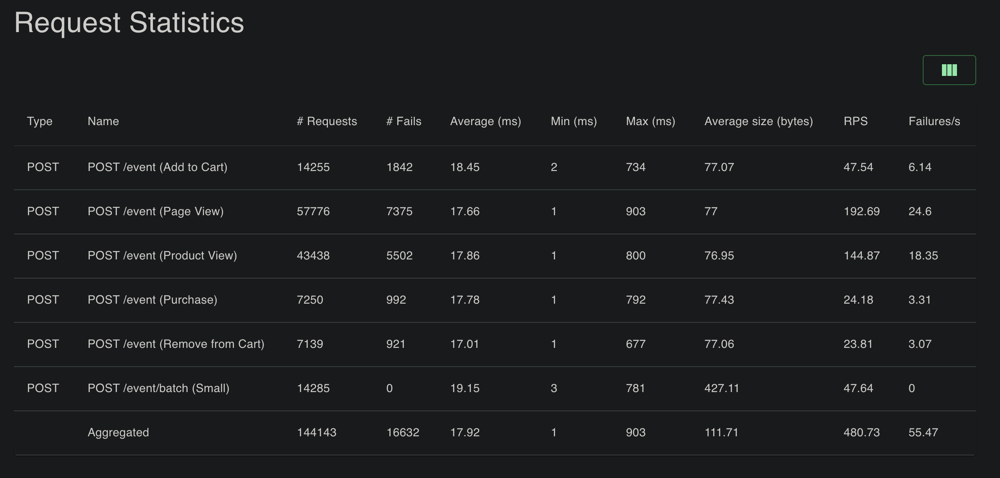
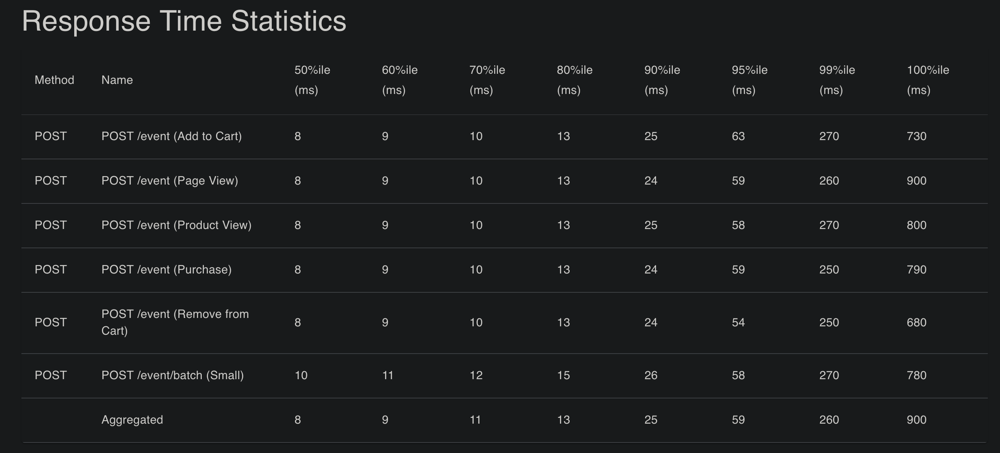
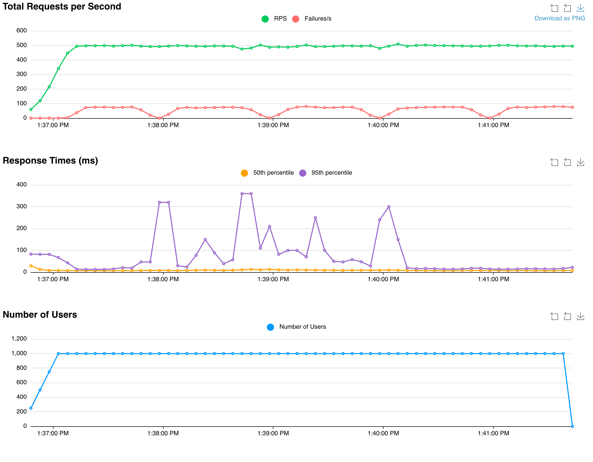
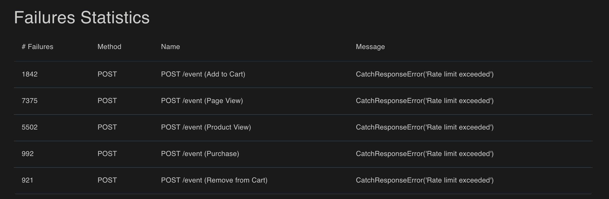
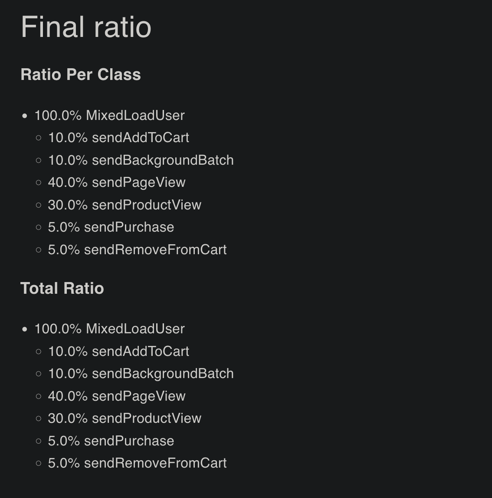
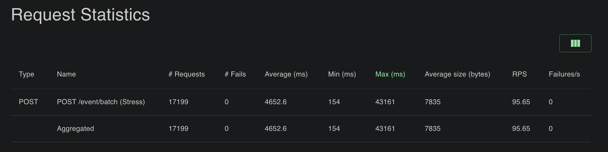
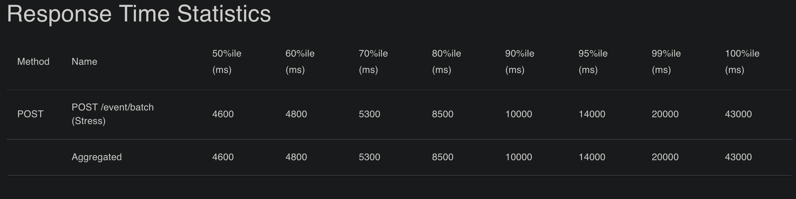
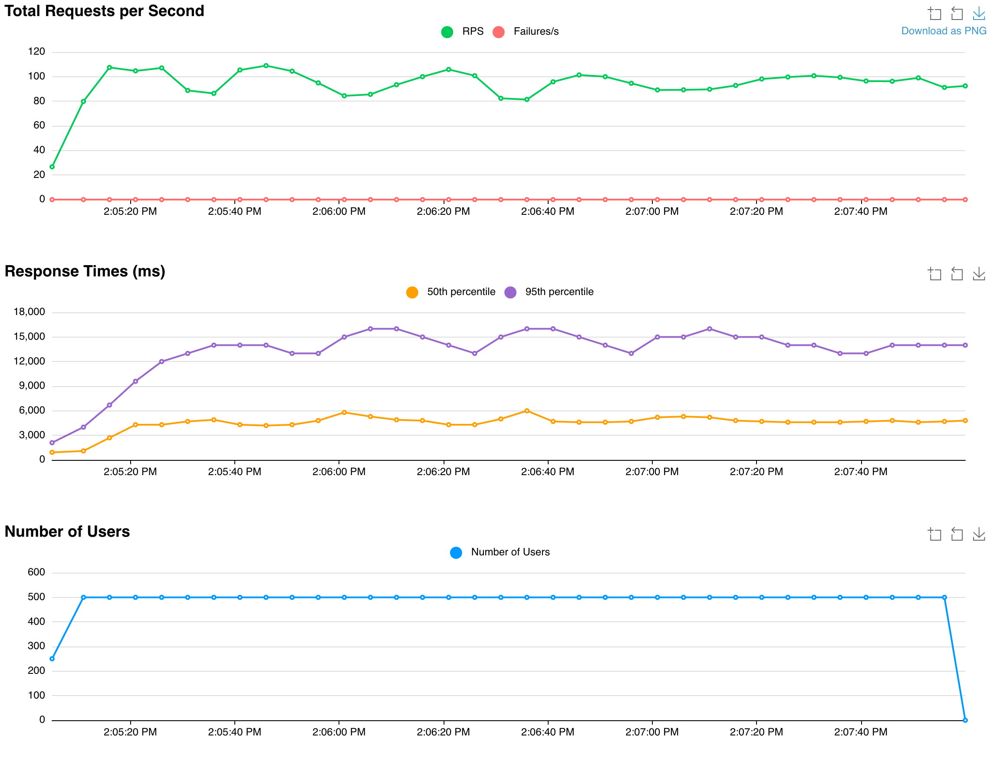
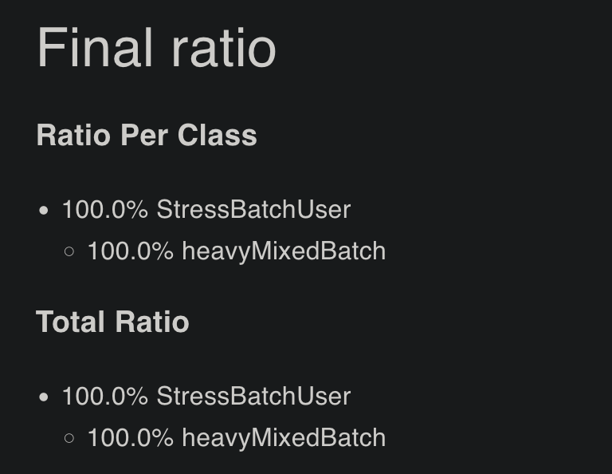

# Stage 1: Synchronous Ingestion Benchmark

**Date:** 2026-01-28

## 🎯 Goal

Verify that the monolithic architecture (Direct DB Insert) can handle **1,000 events/sec** with acceptable latency.

## ⚙️ Configuration

- **App:** FastAPI (1 worker)
- **DB:** PostgreSQL 17 (asyncpg pool size: 5-10)
- **Load Profile:** MixedLoadUser (Funnel: PageView -> Purchase)
- **Test Duration:** 5 minutes
- **Users:** 1000 concurrent
- **Wait Time:** 1-3 seconds (Human-like behavior)
- **Plan Distribution:** 1 PRO (1k RPM), 5 ENTERPRISE (10k RPM)
- **Batch Size:**
  - Realistic: 5-15 events
  - Stress: 200 events

## Results: Realistic Load

### Summary Table

| Metric            | Result            | Target   | Status                     |
| ----------------- | ----------------- | -------- | -------------------------- |
| **Avg RPS**       | 481 req/s         | -        | Limited by wait_time       |
| **Throughput**    | **~913 events/s** | 1000     | Good                       |
| **Latency (p50)** | 8 ms              | < 30 ms  | Excellent                  |
| **Latency (p95)** | 59 ms             | < 100 ms | Good                       |
| **Latency (p99)** | 260 ms            | < 200 ms | Warning (Tail Latency)     |
| **Max Latency**   | **900 ms**        | < 500 ms | Critical Spikes            |
| **Error Rate**    | 11.5%             | -        | Expected (PRO plan limits) |

### Graphs

#### Request Statistics

#### Response Time Statistics

#### Charts

#### Failures Statistics

#### Final Ratio

### Key Observations

1.  **Throughput Success:** The system sustained ~913 events/sec with 1000 concurrent users. The synchronous architecture can handle the volume.
2.  **Tail Latency Bottleneck:** While median latency is low (8ms), the **p99 (260ms)** and **Max (900ms)** show significant degradation.
    - **Cause:** Synchronous `INSERT` operations block the request processing. When Postgres buffers fill up or locks occur, the API worker is blocked, causing timeouts for clients.
3.  **Rate Limiting:** The 11.5% failure rate is expected. It matches the calculated rejection rate for the single PRO project plan under this load ($80 \text{ RPS load} > 16 \text{ RPS limit}$), confirming the Rate Limiter logic works correctly.

---

## Stress Test Results

### Summary Table

| Metric            | Result               | Note                                            |
| ----------------- | -------------------- | ----------------------------------------------- |
| **Avg RPS**       | 95.6 req/s           | Limited by DB I/O                               |
| **Throughput**    | **~19,130 events/s** | (95.6 RPS \* 200 events/batch) 🚀               |
| **Latency (p50)** | 4.6 s                | Severe delay                                    |
| **Latency (p95)** | 14.0 s               | Unusable                                        |
| **Max Latency**   | **43.1 s**           | Critical congestion                             |
| **Failures**      | 0%                   | DB queue handled the load without dropping data |

### Graphs

#### Request Statistics

#### Response Time Statistics

#### Charts

#### Final Ratio

### Key Observations

The system pushed **~19k events/sec** without crashing. However, the synchronous architecture caused latency to skyrocket to **14-43 seconds**. The database became the bottleneck, queuing writes faster than it could commit them.

---

## ✅ Conclusion

Stage 1 is **functionally complete**. I achieved the throughput target.
**However**, the latency spikes (up to 2 seconds) prove that **Direct-to-DB ingestion**.

**Next Step:** Implement **Stage 2 (Decoupling API from DB)** using Redis Streams to decouple the API from the Database and stabilize response times.
