# Stage 2: Ingestion via Redis Streams

**Date:** 2026-02-11

## 🎯 Goal

Verify that decoupling the API from the Database using **Redis Streams** eliminates the database write bottleneck.
**Key Success Criteria:**

1.  **Low API Latency:** API response time (p95) remains low (< 50ms) even under heavy write load.
2.  **High Throughput:** The system can accept events faster than the database can write them (buffering).
3.  **Reliability:** The Worker processes the backlog (Consumer Lag) without data loss.

## ⚙️ Configuration

- **Producer (API):** FastAPI (1 worker) -> Redis Stream
- **Broker:** Valkey/Redis (AOF Enabled)
- **Consumer (Worker):** 1 Python Worker (Batch Size: 100-500)
- **DB:** PostgreSQL 17 (asyncpg)
- **Load Profile:** MixedLoadUser (Human-like behavior with wait_time)
- **Test Duration:** 5 minutes
- **Users:** 1000 concurrent
- **Wait Time:** 1-3 seconds (Human-like behavior)
- **Batch Size:**
  - Realistic: 5-15 events
  - Stress: 200 events

## Results: Realistic Load (Benchmark)

### Summary Table

| Metric                | Result        | Target   | Status (vs Stage 1)       |
| --------------------- | ------------- | -------- | ------------------------- |
| **Avg RPS**           | 334.18 req/s  | -        | Limited by user wait_time |
| **Throughput**        | ~967 events/s | -        | Stable                    |
| **API Latency (p50)** | 5 ms          | < 10 ms  | Excelent                  |
| **API Latency (p95)** | 13 ms         | < 50 ms  | Excelent                  |
| **API Latency (p99)** | 32 ms         | < 200 ms | Excelent                  |
| **Consumer Lag**      | 0 (Max 2)     | 0 - 100  | Perfect                   |
| **Error Rate**        | 0%            | -        | Rate limits was increased |

### Graphs

#### Request Statistics

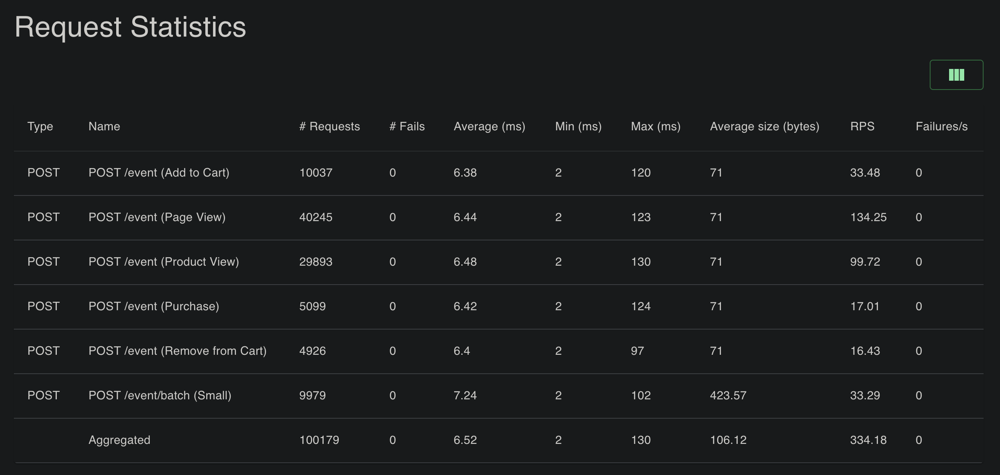

#### Response Time Statistics

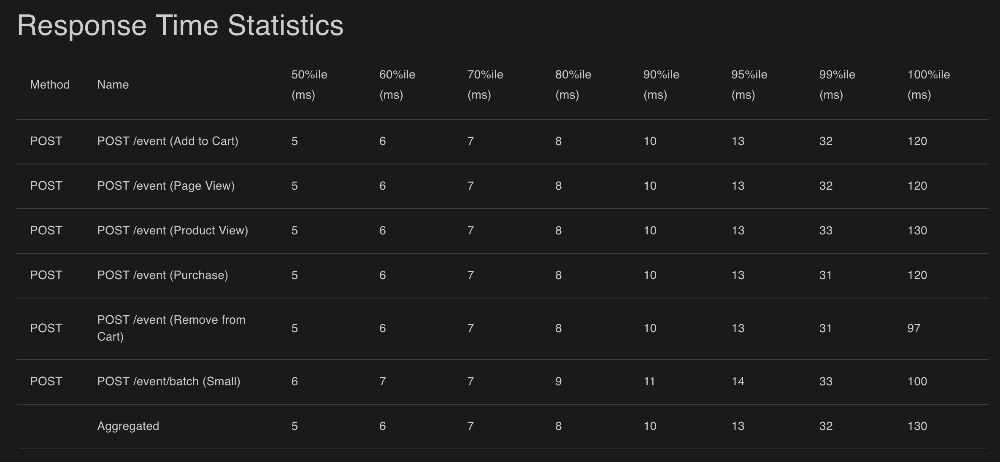

#### Charts

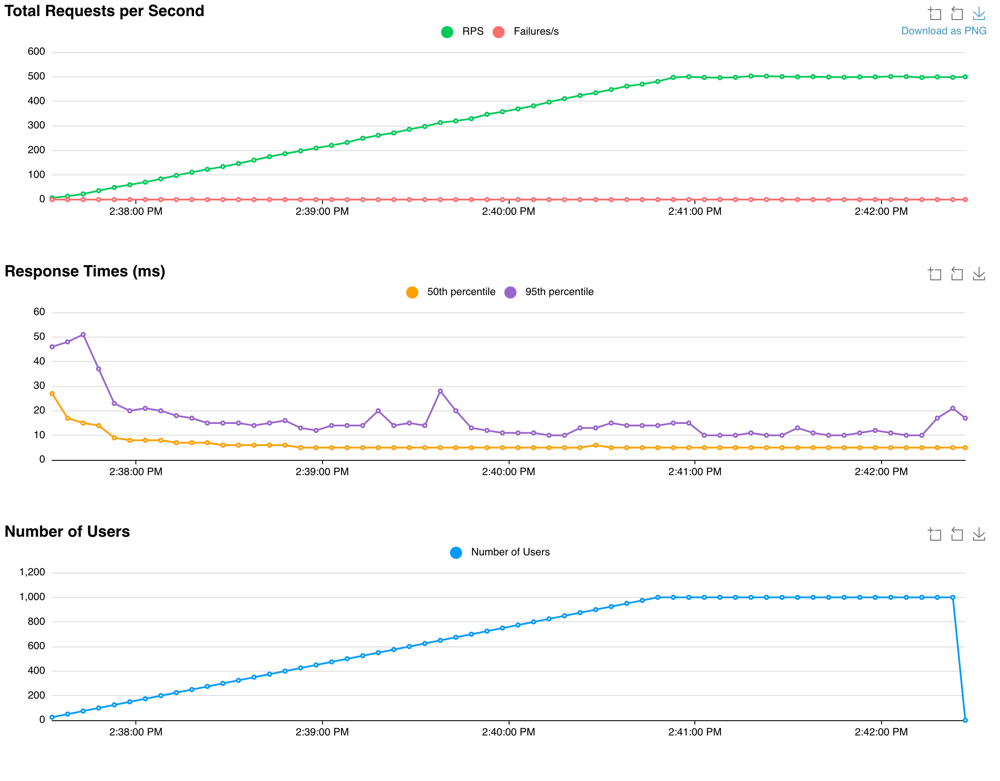

#### Failures Statistics

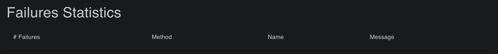

#### Final Ratio

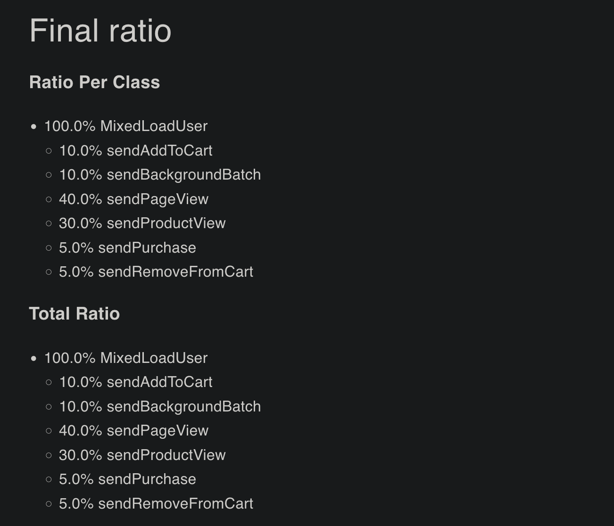

#### Grafana: Worker Health

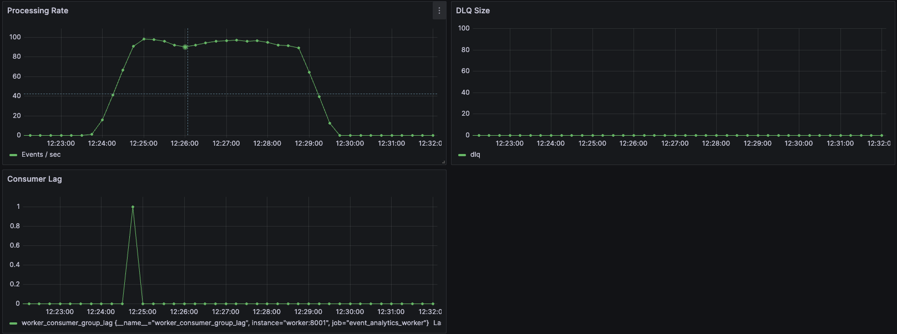

#### Grafana: API Resources

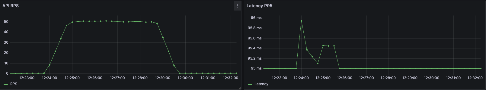

### Key Observations

1.  **Latency Elimination:** The decoupling was a massive success. P95 Latency dropped to **13ms**. Unlike Stage 1, there are no spikes even during batch processing.
2.  **Stability:** With 0% errors (after increasing rate limits), the system behaves predictably.
3.  **Resource Headroom:** The single worker handled ~967 events/sec with **0 Lag**.

---

## Stress Test Results (Crash Test)

### Summary Table

| Metric                | Result           | Note                                                                        |
| --------------------- | ---------------- | --------------------------------------------------------------------------- |
| **Avg RPS**           | 64.5 req/s       | Limited by API CPU (JSON serialization)                                     |
| **Throughput**        | ~13,000 events/s | (64.5 RPS \* 200 events/batch)                                              |
| **API Latency (p95)** | 7.5 s            | High due to CPU saturation (Docker limit), but 6x better than Stage 1 (43s) |
| **Max Consumer Lag**  | > 100,000        | Queue backlog confirmed. Worker is slower than Producer                     |
| **Recovery Time**     | ~60 s            | Time to drain 100k events backlog                                           |

### Graphs

#### Request Statistics

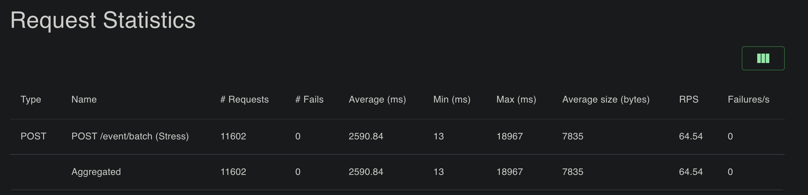

#### Response Time Statistics

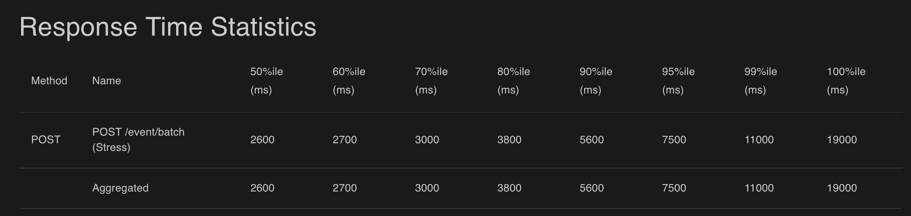

#### Charts

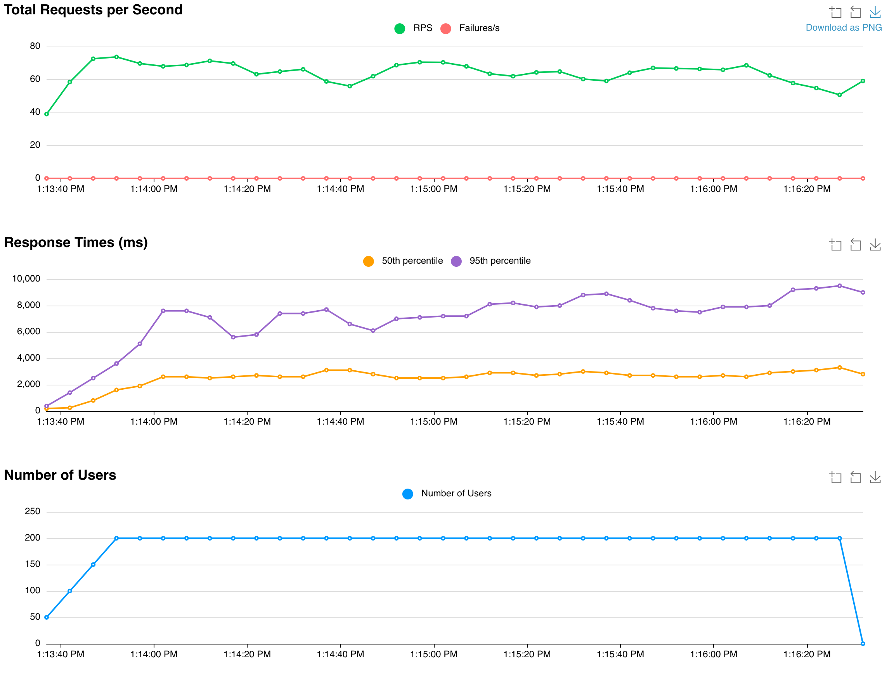

#### Failures Statistics

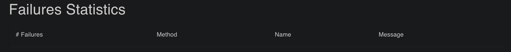

#### Final Ratio

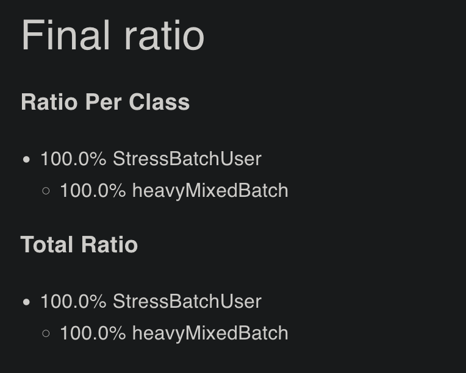

#### Grafana: Worker Health

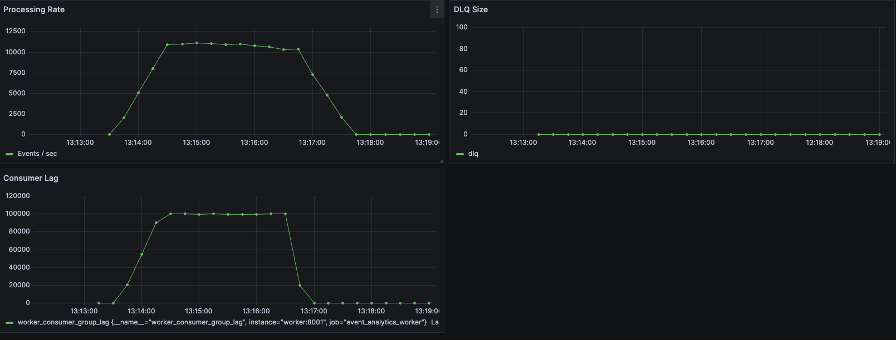

#### Grafana: API Resources

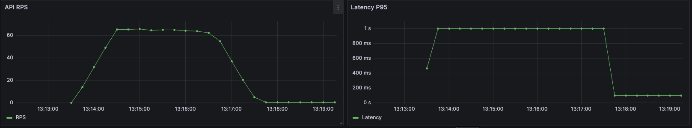

### Key Observations

1.  **Bottleneck Shifted:** The bottleneck moved from **Database I/O** (Stage 1) to **API CPU** (Stage 2). The single Python process handling JSON serialization hit 100% CPU usage.
2.  **Backpressure & Resilience:**
    - Despite the API being overloaded, the **Consumer Lag** grew to 100,000 events.
    - Crucially, **no data was lost**.
    - Once the load stopped, the Worker processed the backlog in ~60 seconds (Recovery Phase).
3.  **Performance Trade-off:** I achieved **~13k stable events/sec** vs Stage 1's "fake" 19k events/sec (which had 40s+ latency).

### Result with 3 api workers

#### Grafana: Worker Health

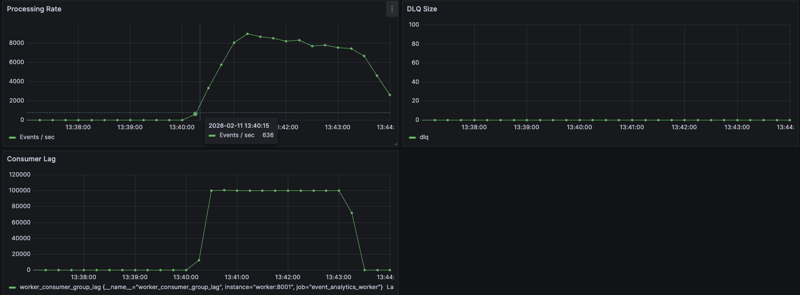

#### Request and Response Statistics

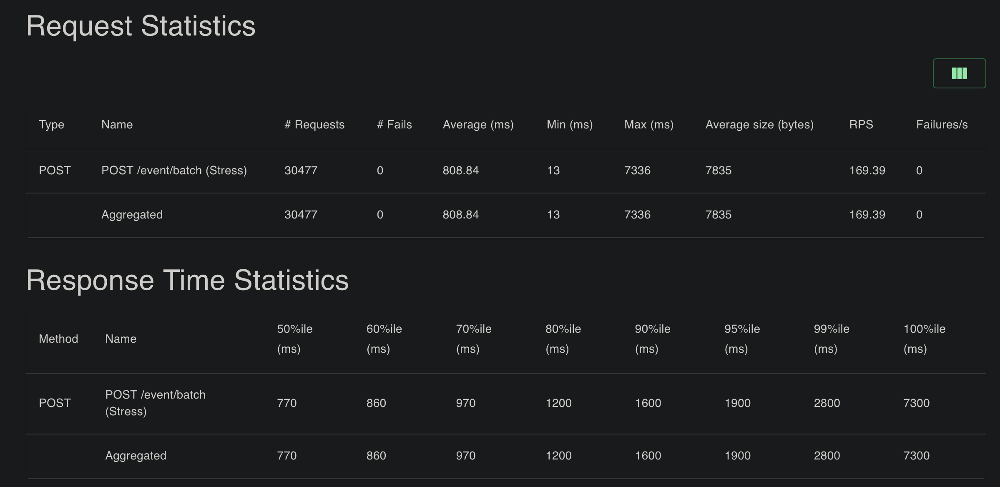

#### Charts

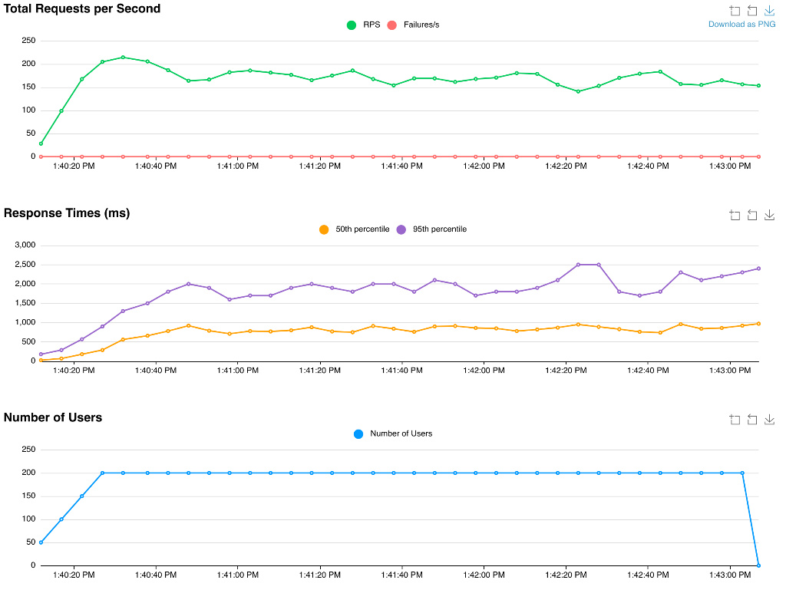

---

## ✅ Conclusion

Stage 2 is **successful** in terms of architecture decoupling, but highlighted a need for API optimization.

1.  **Throughput:** I achieved ~13k stable events/sec.
2.  **Bottleneck Identification:** The single API worker is the limiting factor for ingestion speed (CPU bound).

**Trade-off:** I introduced **Eventual Consistency**. Data is not in the DB immediately but is guaranteed to arrive (At-Least-Once delivery).
